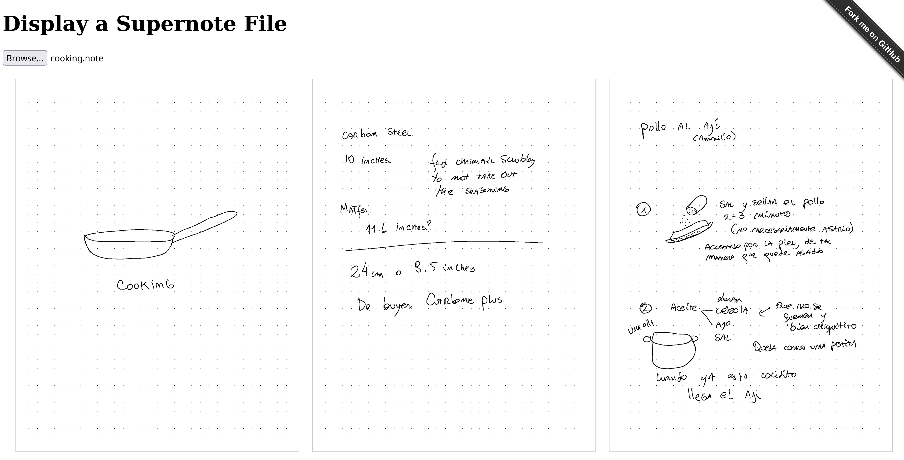

You can try this [online](https://cristianvasquez.github.io/supernote-web-viewer/
)

All transformations occur directly in your browser (your notes remain private and are not transmitted to any server)

Sister app:
This app is powered by the [supernote-typescript](https://github.com/philips/supernote-typescript/tree/main) library,
which is
based on [Tiemen/supernote](https://gitlab.com/Tiemen/supernote) and the
original [supernote-tool](https://github.com/jya-dev/supernote-tool).

There is another app to try:  [supernote-tldraw](https://github.com/cristianvasquez/supernote-tldraw)
that allows to manipulate notes in a canvas
